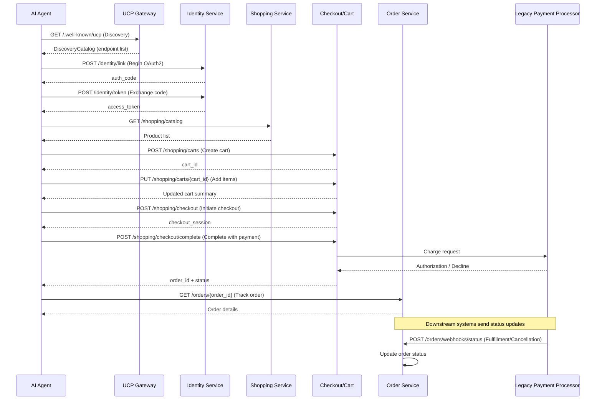

## Agent Commerce Bridge – High-Level Architecture

This document describes the See's Candies UCP Gateway—a full-lifecycle e-commerce platform implementing the Unified Commerce Protocol (UCP) with legacy payment processor settlement.

### System Overview

The system consists of four main components:

1. **Identity Service** – OAuth2-style shopper identity linking and token exchange
2. **Shopping Service** – Product catalog, cart management, and checkout initiation
3. **Order Service** – Post-purchase order tracking and webhook-based status updates
4. **Legacy Processor Adapter** – Legacy payment processor integration for payment settlement

### Complete Transaction Flow

### Key Components

#### Discovery Endpoint (GET /.well-known/ucp)
Returns a `DiscoveryCatalog` describing 11 UCP-compliant endpoints:
- Identity: `link`, `token`
- Shopping: `catalog`, `cart.create`, `cart.update`, `cart.get`
- Checkout: `checkout.initiate`, `checkout.complete`
- Orders: `orders.get`, `orders.list`, `orders.webhook.status`

#### Identity Service
- **POST /identity/link** – Starts OAuth2 flow (mocked)
- **POST /identity/token** – Exchanges authorization code for access token

#### Shopping Service
- **GET /shopping/catalog** – Lists See's Candies products
- **POST /shopping/carts** – Creates a new cart
- **PUT /shopping/carts/{cart_id}** – Updates cart items
- **GET /shopping/carts/{cart_id}** – Retrieves cart state

#### Checkout Service
- **POST /shopping/checkout** – Initiates checkout state machine
- **POST /shopping/checkout/complete** – Completes checkout and calls legacy payment processor for settlement

#### Order Service
- **GET /orders/{order_id}** – Retrieves order details
- **GET /orders** – Lists all orders
- **POST /orders/webhooks/status** – Receives fulfillment/cancellation updates from downstream systems

#### Error Handling
- **Legacy Processor Decline Mapping**: Decline codes (D001, D002, etc.) are mapped to UCP-compliant error codes
- **Validation Errors**: Request payloads are validated per UCP schema with structured error responses

### Architecture Rationale

1. **Discovery First** – Agents query `/.well-known/ucp` to dynamically discover capabilities
2. **Modular Services** – Each service (identity, shopping, orders) is independently deployable
3. **Legacy Processor-Backed Settlement** – Real payment processing via legacy payment processor, not mocked
4. **Webhook Support** – Asynchronous order status updates from downstream fulfillment systems
5. **UCP-Compliant Responses** – Stable error codes, schema references, and HTTP semantics for agent consumption

