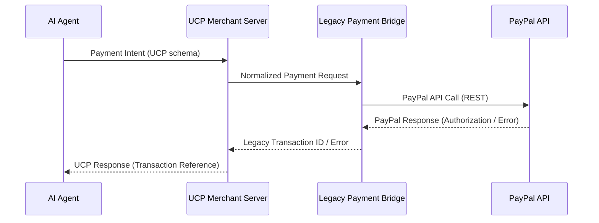

## Agent Commerce Bridge – High-Level Architecture

This document describes the high-level interaction flow between the Agent Commerce Bridge components.

```mermaid
sequenceDiagram
    participant A as AI Agent
    participant U as UCP Merchant Server
    participant L as Legacy Payment Bridge
    participant P as PayPal API

    A->>U: Payment Intent (UCP schema)
    U->>L: Normalized Payment Request
    L->>P: PayPal API Call (REST)
    P-->>L: PayPal Response (Authorization / Error)
    L-->>U: Legacy Transaction ID / Error
    U-->>A: UCP Response (Transaction Reference)
```

